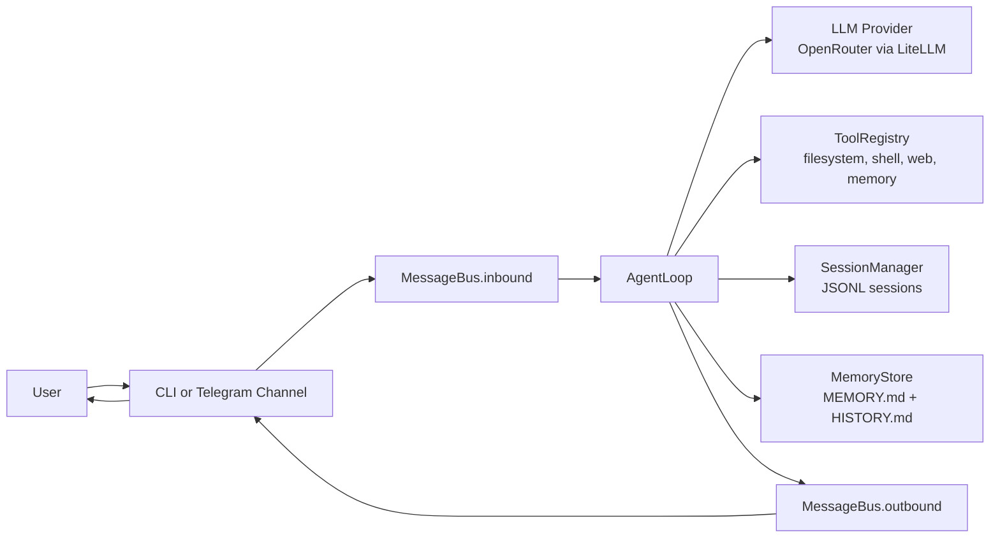

# sideclaw

SideClaw is a lightweight AI assistant framework for building tool-using chat agents with persistent sessions and optional channel integrations.

It provides:

- A core agent loop with tool calling
- CLI and Telegram channel entry points
- Session persistence and long-term memory
- Persisted cron scheduling for recurring chat tasks
- Config-driven provider/channel/tool setup

## Why SideClaw

The name **SideClaw** comes from the idea of a reliable sidekick: always at your side, ready to help with the next task. It blends that companion feeling with a practical "tooling claw" identity for getting real work done.

SideClaw is designed for fast iteration on practical assistants:

- Small, readable codebase
- Clear component boundaries
- Real tool execution (files, shell, web, memory)
- Easy local development with `uv`, `pytest`, and `typer`

## Architecture At A Glance



See [TECHNICAL.md](./TECHNICAL.md) for detailed internals and data flow.
See [AGENTS.md](./AGENTS.md) for contributor-facing guidance tailored to coding agents working on this repo.

## Project Layout

```text
sideclaw/
  sideclaw/
    agent/         # core orchestration loop + context building
    bus/           # async inbound/outbound message queues
    channels/      # platform adapters (Telegram)
    cli/           # Typer entrypoint plus command implementations
    config/        # pydantic schema + JSON loader/saver
    memory/        # long-term memory store
    providers/     # LLM abstraction + OpenRouter implementation
    session/       # JSONL-backed session persistence
    skills/        # built-in prompt skills
    cron/          # persisted scheduler service
    tools/         # tool base class + built-in tools
    templates/     # bootstrap identity/soul prompt files
  tests/           # unit + integration tests
```

## Requirements

- Python `>=3.13`
- [`uv`](https://docs.astral.sh/uv/) for dependency and environment management
- OpenRouter API key for live model calls
- Optional: Telegram bot token for gateway mode
- Optional: `playwright` browser install for browser automation (`uv run playwright install`)

## Quick Start

1. Install dependencies:

```bash
uv sync --dev
```

2. Run interactive onboarding:

```bash
uv run sideclaw onboard
```

3. Check status:

```bash
uv run sideclaw status
```

4. Run the local CLI assistant:

```bash
uv run sideclaw agent
```

5. Single non-interactive message:

```bash
uv run sideclaw agent --message "Summarize this repo"
```

## Gateway Mode (Telegram)

After onboarding with Telegram config values:

```bash
uv run sideclaw gateway
```

The gateway runs continuously, receives inbound channel messages, and routes outbound responses through the matching channel adapter.

Scheduled jobs are executed by the same gateway process, so recurring Telegram delivery works while
`sideclaw gateway` is running.

Example:

```text
Send me a new meal plan every Friday night at 9pm.
```

The agent can map that to a cron job for the current chat.

You can also manage jobs explicitly:

```bash
uv run sideclaw cron add \
  --schedule "0 21 * * 5" \
  --prompt "Send me a new meal plan" \
  --channel telegram \
  --chat-id 123456789 \
  --name "weekly meal plan"

uv run sideclaw cron list
uv run sideclaw cron disable <job-id>
uv run sideclaw cron enable <job-id>
uv run sideclaw cron remove <job-id>
```

## Configuration

Default config path:

```text
~/.sideclaw/config.json
```

Core configuration sections:

- `agent`: model, workspace, token/temperature defaults, memory window
- `providers.openrouter`: API key and base URL
- `channels.telegram`: bot token + allowlist
- `tools`: browser enablement, fal.ai image key/model/upscaler settings, shell exec, text-to-speech settings, web search provider/key, and other tool-specific flags
- `cron`: scheduler enable flag and polling interval

Workspace defaults to:

```text
~/.sideclaw/workspace
```

Onboarding creates:

- `sessions/` for per-chat JSONL transcripts
- `memory/MEMORY.md` for consolidated long-term context
- `memory/HISTORY.md` for timestamped memory events
- `IDENTITY.md` and `SOUL.md` from built-in templates
- `skills/cron/SKILL.md` for scheduled-task routing guidance

## Built-in Tools

- `read_file`: read a workspace file
- `write_file`: write a file in workspace
- `edit_file`: single text replacement in a file
- `list_dir`: list directory entries
- `exec`: optional shell access, disabled by default and intended only for trusted local deployments
- `browser`: optional Playwright-backed browser automation for navigation, snapshots, screenshots, clicks, typing, and tab control
- `image_generation`: optional fal.ai image generation with model-aware request shaping and optional upscaling, only registered when a fal API key is configured
- `send_message`: optional Telegram delivery tool for sending text or files to known chats
- `text_to_speech`: optional artifact-generating speech synthesis with configurable provider settings
- `web_search`: optional web search integration, only registered when provider + API key are configured
- `web_fetch`: fetch raw URL text
- `save_memory`: update long-term memory store
- `cron`: add/list/remove/enable/disable recurring jobs for the current chat

When enabled, `exec` runs inside the configured workspace, strips secret-like environment
variables, blocks obviously dangerous command patterns, and requires explicit CLI approval for
mutating commands. Gateway/channel usage is denied by default.

## Development

Run tests:

```bash
uv run pytest
```

Run lint:

```bash
uv run ruff check .
```

Run format:

```bash
uv run ruff format .
```

## External References

- [Typer](https://typer.tiangolo.com/)
- [Pydantic](https://docs.pydantic.dev/)
- [LiteLLM](https://docs.litellm.ai/)
- [OpenRouter](https://openrouter.ai/docs/api-reference/overview)
- [python-telegram-bot](https://docs.python-telegram-bot.org/)
