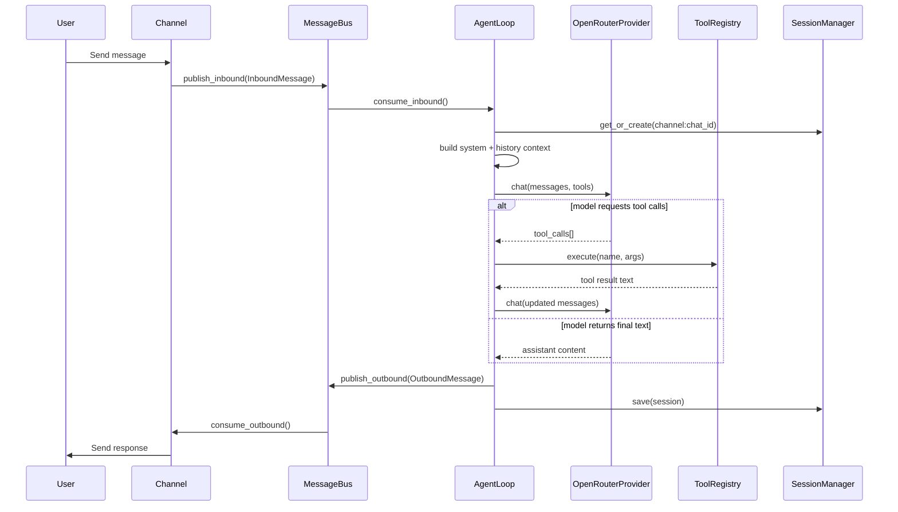

# SideClaw Technical Documentation

This document explains SideClaw internals, runtime flow, storage model, and extension points.

## 1. System Overview

SideClaw is an async, message-driven assistant runtime with four primary concerns:

- Ingest inbound messages from one or more channels
- Build prompt context (identity + memory + history + runtime metadata)
- Execute an LLM/tool loop until a final assistant response is produced
- Persist conversation and memory state for continuity

## 2. Core Components

| Component | File(s) | Responsibility |
| --- | --- | --- |
| CLI entry points | `sideclaw/cli/commands.py` | Onboarding, status, one-shot and interactive agent mode, gateway runtime |
| Message bus | `sideclaw/bus/queue.py` | Async inbound/outbound queue decoupling channels from agent logic |
| Agent loop | `sideclaw/agent/loop.py` | Orchestrates LLM calls, tool execution, response publishing, memory consolidation |
| Prompt builder | `sideclaw/agent/context.py` | Builds system prompt from base identity, templates, memory, runtime info |
| Provider layer | `sideclaw/providers/base.py`, `sideclaw/providers/openrouter.py` | LLM abstraction and OpenRouter implementation via LiteLLM |
| Tool runtime | `sideclaw/tools/*` | Built-in tools and registry for schema/export/dispatch |
| Session store | `sideclaw/session/manager.py` | JSONL persistence per channel/chat key |
| Memory store | `sideclaw/memory/store.py` | Long-term memory and append-only history files |
| Channel adapters | `sideclaw/channels/*` | Platform-specific I/O (Telegram currently) |

## 3. End-to-End Message Flow



### Loop guard

`MAX_TOOL_ITERATIONS = 20` in `sideclaw/agent/loop.py` bounds tool recursion and prevents infinite call loops.

## 4. Prompt and Context Assembly

`ContextBuilder` composes the system prompt from:

1. A built-in baseline identity string
2. Bootstrap files in workspace (when present):
   - `IDENTITY.md`
   - `SOUL.md`
   - `USER.md`
   - `TOOLS.md`
3. Long-term memory (`memory/MEMORY.md`) if available
4. Runtime metadata:
   - UTC timestamp
   - channel
   - chat id

Message payload sent to the provider:

- `system` prompt (composed context)
- prior history from session (bounded and user-turn-aligned)
- current `user` message

## 5. Data and Persistence Model

### Session persistence

- Key: `<channel>:<chat_id>`
- Storage file: `sessions/<channel>__<chat_id>.jsonl`
- Layout:
  - Line 1: metadata JSON (`created_at`, `updated_at`, `last_consolidated`)
  - Following lines: raw message objects in chronological order

### Memory persistence

- `memory/MEMORY.md`: authoritative long-term summary
- `memory/HISTORY.md`: append-only timestamped event log

### Consolidation behavior

When unconsolidated message count reaches `agent.memory_window` (default `50`):

- Old messages are summarized by the LLM
- Result overwrites `MEMORY.md`
- A short topics entry is appended to `HISTORY.md`
- `last_consolidated` is advanced to keep recent working context

## 6. Tool System

All tools implement `Tool`:

- `name`
- `description`
- `parameters` (JSON Schema)
- async `execute(**kwargs) -> str`

`ToolRegistry`:

- Exposes function-call schemas to the model
- Dispatches calls by name
- Catches tool exceptions at boundary and returns error strings

Default tools registered by `AgentLoop.register_default_tools()`:

- Filesystem: `read_file`, `write_file`, `edit_file`, `list_dir`
- Execution: `exec`
- Web: `web_search`, `web_fetch`
- Memory: `save_memory`

### Filesystem sandboxing

Filesystem tools resolve paths relative to configured workspace and reject traversal outside it (`../../` style escapes).

## 7. Configuration Model

Config file path: `~/.sideclaw/config.json`

Schema root: `Config` in `sideclaw/config/schema.py`

- `agent`
  - `model` default: `openai/gpt-4o-mini`
  - `workspace` default: `~/.sideclaw/workspace`
  - `max_tokens` default: `4096`
  - `temperature` default: `0.7`
  - `memory_window` default: `50`
- `providers.openrouter`
  - `api_key` (required to run agent/gateway)
  - `api_base` default: `https://openrouter.ai/api/v1`
- `channels.telegram`
  - bot token
  - optional sender allowlist
- `tools`
  - `exec_timeout` default: `60`
  - `web_search_api_key` optional

`onboard` CLI command supports merge-safe updates of existing config instead of destructive overwrite.

## 8. Channel Layer

Telegram implementation (`sideclaw/channels/telegram.py`) provides:

- Long polling startup/shutdown lifecycle
- `/start` greeting
- `/new` session reset trigger
- Optional sender allowlist enforcement
- Outbound chunking at Telegram 4096-char limit
- Markdown send with plain-text fallback on parse failure

Gateway mode routes outbound responses by matching `response.channel` to `channel_name`.

## 9. Provider Layer

`OpenRouterProvider`:

- Uses async LiteLLM `acompletion`
- Prefixes models with `openrouter/` when needed
- Sanitizes message keys before API call
- Converts LiteLLM tool call payloads into internal `ToolCallRequest`
- Converts provider/SDK exceptions into `LLMResponse(finish_reason="error")`

## 10. Failure Handling and Operational Notes

- Tool failures are isolated and surfaced as tool result text, not process crashes.
- LLM provider failures return an explicit error response.
- Gateway processing wraps message handling and logs exceptions.
- `exec` tool has timeout control but executes shell commands directly; treat as high-trust environment capability.

## 11. Testing Strategy

Test suite covers:

- Agent behavior (`tests/agent`)
- Bus semantics (`tests/bus`)
- Channel logic (`tests/channels`)
- CLI flows (`tests/cli`)
- Config schema/loader (`tests/config`)
- Memory/session persistence (`tests/memory`, `tests/session`)
- Provider parsing and error boundaries (`tests/providers`)
- Tool behavior and edge cases (`tests/tools`)
- End-to-end integration paths (`tests/test_integration.py`)

Run all tests:

```bash
uv run pytest
```

## 12. Extensibility Guide

### Add a new tool

1. Implement `Tool` subclass in `sideclaw/tools/`
2. Register it in `AgentLoop.register_default_tools()`
3. Add tests under `tests/tools/`

### Add a new provider

1. Implement `LLMProvider` in `sideclaw/providers/`
2. Extend config schema for provider credentials/options
3. Wire provider creation in CLI boot paths (`agent`, `gateway`)

### Add a new channel

1. Implement `BaseChannel` in `sideclaw/channels/`
2. Add config schema section
3. Instantiate in gateway startup path
4. Add focused tests for filtering, lifecycle, and outbound behavior

## 13. External Documentation

- Typer: https://typer.tiangolo.com/
- Pydantic: https://docs.pydantic.dev/
- LiteLLM: https://docs.litellm.ai/
- OpenRouter API: https://openrouter.ai/docs/api-reference/overview
- python-telegram-bot: https://docs.python-telegram-bot.org/
