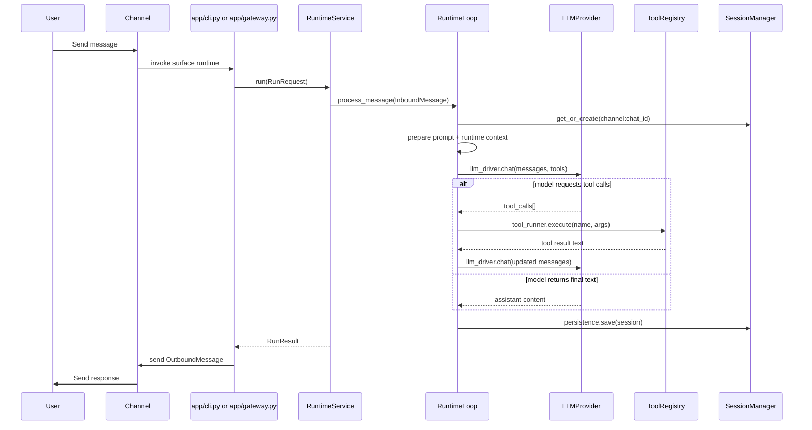

# SideClaw Technical Documentation

This document explains SideClaw internals, runtime flow, storage model, and extension points.

## 1. System Overview

SideClaw is an async, message-driven assistant runtime with four primary concerns:

- Ingest inbound messages from one or more channels
- Build prompt context (identity + memory + history + runtime metadata)
- Execute an LLM/tool loop until a final assistant response is produced
- Persist conversation and memory state for continuity
- Execute persisted cron jobs through the same agent and delivery pipeline

The runtime now exposes an explicit run boundary:

- surfaces create a semantic `RunRequest`
- `RuntimeService` owns the public execution entrypoint
- `RuntimeLoop` performs the underlying LLM/tool orchestration
- surfaces receive a `RunResult` instead of depending directly on transport-shaped loop returns

## 2. Core Components

| Component | File(s) | Responsibility |
| --- | --- | --- |
| CLI entry points | `sideclaw/cli/main.py`, `sideclaw/cli/commands/*`, `sideclaw/cli/render/*` | Typer entrypoint, thin command surfaces, and shared CLI presentation helpers |
| App composition layer | `sideclaw/app/factory.py`, `sideclaw/app/cli.py`, `sideclaw/app/gateway.py` | Shared runtime construction plus surface-specific approval/policy adaptation |
| Runtime boundary | `sideclaw/runtime/service.py`, `sideclaw/runtime/state.py`, `sideclaw/runtime/models/*` | Stable run API (`RunRequest`/`RunResult`), transient run state, and typed runtime models |
| Message bus | `sideclaw/bus/queue.py` | Async inbound/outbound queue decoupling channel adapters from gateway ingress |
| Runtime loop | `sideclaw/runtime/loop.py`, `sideclaw/runtime/execution/*` | `RuntimeLoop` orchestration shell plus extracted prepare, LLM, tool, persistence, and output execution helpers |
| Prompt builder | `sideclaw/agent/prompt_builder.py` | Builds system prompt from base docs, workspace context, memory, and runtime info |
| Provider layer | `sideclaw/providers/base.py`, `sideclaw/providers/models.py`, `sideclaw/providers/retry.py`, `sideclaw/providers/anthropic.py`, `sideclaw/providers/openai_provider.py`, `sideclaw/providers/ollama.py`, `sideclaw/providers/openrouter.py` | LLM abstraction, model registry, retry wrapper, and Anthropic, OpenAI, Ollama, and OpenRouter implementations |
| Tool runtime | `sideclaw/tools/*` | Built-in tools, registry, and construction via `build_default_tool_registry()` |
| Session store | `sideclaw/session/manager.py` | JSONL persistence per channel/chat key |
| Memory store | `sideclaw/memory/store.py` | Long-term memory and append-only history files |
| Channel adapters | `sideclaw/channels/*` | Platform-specific I/O (Telegram currently) |
| Cron scheduler | `sideclaw/cron/service.py` | Persisted job storage, due-run computation, and background execution |

## 3. End-to-End Message Flow



### Loop guard

`MAX_TOOL_ITERATIONS = 20` in `sideclaw/runtime/loop.py` bounds tool recursion and prevents infinite call loops.

## 4. Prompt and Context Assembly

`PromptBuilder` composes the system prompt from:

1. Canonical workspace docs on the hot path:
   - `AGENTS.md`
   - `SOUL.md`
   - `docs/core-beliefs.md`
2. Routed workspace docs from `sideclaw/workspace/context.py`
3. Long-term memory and workspace history when relevant
4. Runtime metadata:
   - UTC timestamp
   - channel
   - chat id
5. Available skills summary plus relevant full skills loaded from `skills/**/*.md`

Message payload sent to the provider:

- `system` prompt (composed context)
- prior history from session (bounded and user-turn-aligned)
- current `user` message

## 4.1 Runtime Models

The runtime boundary uses a few typed models to separate execution semantics from adapter DTOs:

- `RunRequest`: one unit of runtime execution, usually one inbound user message, cron prompt, or approval reply
- `RuntimeContext`: resolved run metadata such as run id, surface, conversation id, and session key
- `RuntimeEvent`: typed progress/event payloads for future streaming and replay
- `RuntimeOutput`: surfaced artifacts emitted by a run, currently text and later attachments/media
- `RunResult`: final runtime status plus output text, outputs, and events

Today `RuntimeService` adapts `RunRequest` into the existing `InboundMessage`-driven `RuntimeLoop`, but the public boundary is runtime-shaped rather than channel-shaped.

Internally, `RuntimeLoop` now delegates execution work to `sideclaw/runtime/execution/prepare.py`,
`llm_driver.py`, `tool_runner.py`, `persistence.py`, and `output.py` instead of owning those steps inline.

## 5. Data and Persistence Model

### Session persistence

- Key: `<channel>:<chat_id>`
- Storage file: `sessions/<channel>__<chat_id>.jsonl`
- Layout:
  - Line 1: metadata JSON (`created_at`, `updated_at`, `last_consolidated`)
  - Following lines: raw message objects in chronological order

### Memory persistence

- `memory/MEMORY.md`: authoritative long-term summary
- `memory/HISTORY.md`: append-only timestamped event log

### Cron persistence

- `cron/jobs.json`: persisted scheduled jobs
- Each job stores:
  - cron expression
  - prompt payload
  - target channel and chat id
  - enabled flag
  - created/updated timestamps
  - last run time and last error

### Consolidation behavior

When unconsolidated message count reaches `agent.memory_window` (default `50`):

- Old messages are summarized by the LLM
- Result overwrites `MEMORY.md`
- A short topics entry is appended to `HISTORY.md`
- `last_consolidated` is advanced to keep recent working context

## 6. Tool System

All tools implement `Tool`:

- `name`
- `description`
- `parameters` (JSON Schema)
- async `execute(**kwargs) -> str`

`ToolRegistry`:

- Exposes function-call schemas to the model
- Dispatches calls by name
- Catches tool exceptions at boundary and returns error strings

Default tools are registered by `build_default_tool_registry()` in `sideclaw/tools/registry.py`:

- Filesystem: `read_file`, `write_file`, `edit_file`, `list_dir`
- Execution: `exec`
- Web: `web_search`, `web_fetch`
- Memory: `save_memory`
- Scheduling: `cron`

### Filesystem sandboxing

Filesystem tools resolve paths relative to configured workspace and reject traversal outside it (`../../` style escapes).

## 7. Configuration Model

Config file path: `~/.sideclaw/config.json`

Schema root: `Config` in `sideclaw/config/schema.py`

- `agent`
  - `model` default: `openai/gpt-4o-mini`
  - `workspace` default: `~/.sideclaw/workspace`
  - `max_tokens` default: `4096`
  - `temperature` default: `0.7`
  - `memory_window` default: `50`
- `agent.provider` default: `auto` — selects the LLM provider; `auto` infers from model name
- `providers.anthropic`
  - `api_key` (required when using Anthropic models directly)
- `providers.openai`
  - `api_key` (required when using OpenAI models directly)
  - `api_base` default: `https://api.openai.com/v1`
- `providers.ollama`
  - `api_base` default: `http://localhost:11434/v1`
- `providers.openrouter`
  - `api_key` (required when using OpenRouter)
  - `api_base` default: `https://openrouter.ai/api/v1`
- `channels.telegram`
  - bot token
  - optional sender allowlist
- `tools`
  - `exec_timeout` default: `60`
  - `web_search_api_key` optional
- `cron`
  - `enabled` default: `true`
  - `poll_interval_seconds` default: `30`

`onboard` CLI command supports merge-safe updates of existing config instead of destructive overwrite.

## 8. Channel Layer

Telegram implementation (`sideclaw/channels/telegram.py`) provides:

- Long polling startup/shutdown lifecycle
- `/start` greeting
- `/new` session reset trigger
- Optional sender allowlist enforcement
- Outbound chunking at Telegram 4096-char limit
- Markdown send with plain-text fallback on parse failure

Gateway mode routes outbound responses by matching `response.channel` to `channel_name`.

## 8.1 CLI Render Layer

CLI presentation and runtime construction are both split from command behavior:

- `sideclaw/cli/render/console.py` owns shared Rich console access plus input/output helpers.
- `sideclaw/cli/render/formatting.py` owns reusable markup, display strings, and Rich renderables for status, cron, onboarding, gateway, and interactive agent output.
- `sideclaw/cli/commands/*` keep command control flow and config loading only.
- `sideclaw/app/factory.py` builds the shared runtime graph lazily so unrelated CLI commands do not import runtime-heavy dependencies at process startup.
- `sideclaw/app/cli.py` and `sideclaw/app/gateway.py` adapt the shared graph for their host surfaces.

This keeps the CLI surface thin while preserving a dedicated place for future gateway/API/web composition differences.

## 9. Cron Scheduling

`CronService` persists jobs to `cron/jobs.json` and runs due jobs in the gateway process.

- CLI commands manage jobs directly.
- The `cron` tool lets the agent create jobs for the current chat.
- Cron executions are turned into `RunRequest`s with `user_id="cron"` and routed through `RuntimeService`.
- Outbound responses from scheduled jobs are routed through the same channel adapter used for live chat.
- `CronTool` blocks nested scheduling during cron execution to avoid runaway self-scheduling loops.

## 10. Provider Layer

### Model Registry

`ModelRegistry` in `sideclaw/providers/models.py` is the single source of truth for model metadata
and provider detection. Each registered `ModelInfo` carries `id`, `provider`, `context_window`,
`max_output_tokens`, and capability flags (`supports_tools`, `supports_vision`, `supports_streaming`).

Detection strategy (used by `_detect_provider()` in the factory):

1. **Exact match** in registry → return `ModelInfo.provider`
2. **Prefix match** (`claude` → anthropic, `gpt-`/`o1-`/`o3-`/`o4-` → openai, `ollama/` → ollama)
3. **Fallback** → openrouter

Custom models can be registered via `ModelRegistry.register()`.

### Provider Selection

Provider selection is handled by `_build_provider()` in `sideclaw/app/factory.py`. When
`agent.provider` is `"auto"` (the default), the factory delegates to `ModelRegistry.detect_provider()`.

Explicit values (`"anthropic"`, `"openai"`, `"ollama"`, `"openrouter"`) bypass auto-detection.

### Retry Wrapper

`RetryProvider` in `sideclaw/providers/retry.py` wraps every inner provider with automatic retry
and exponential backoff. Individual providers let exceptions propagate; `RetryProvider` handles them.

- Transient error detection via `status_code` attribute (429, 500, 502, 503, 504) and string
  marker matching (`"rate limit"`, `"overloaded"`, `"timeout"`, etc.)
- Exponential backoff with ±25% jitter: `min(base_delay * 2^attempt, max_delay) ± 25%`
- Image-unsupported error fallback: strips `image_url` content blocks and retries
- Non-transient errors are converted to `LLMResponse(finish_reason="error")` immediately
- After exhausting retries, returns `LLMResponse(finish_reason="error")` instead of raising
- Configurable via `agent.retry_max` (default 3), `agent.retry_base_delay` (default 1.0s),
  `agent.retry_max_delay` (default 10.0s)

### AnthropicProvider

- Uses the official `anthropic` SDK (`AsyncAnthropic`)
- Extracts `system` messages into the separate `system` parameter required by the Messages API
- Converts OpenAI-style tool definitions to Anthropic `input_schema` format
- Converts `tool_use` / `tool_result` blocks between OpenAI and Anthropic conventions
- Maps `stop_reason`: `end_turn` → `stop`, `tool_use` → `tool_calls`, `max_tokens` → `length`
- Lets exceptions propagate to `RetryProvider`
- **Prompt caching** (enabled by default via `providers.anthropic.prompt_caching`):
  - System prompt emitted as list-of-blocks with `cache_control: {"type": "ephemeral"}` on the
    last block (uses 1 of 4 available cache breakpoints)
  - Tool definitions get `cache_control` on the last tool (uses 1 breakpoint)
  - Cache usage fields (`cache_creation_tokens`, `cache_read_tokens`) extracted from response
    when present
  - Can reduce input token costs by ~90% on cache hits for stable system prompts and tools

### OpenAIProvider

- Uses the official `openai` SDK (`AsyncOpenAI`)
- Messages pass through in native OpenAI format with key sanitization
- Tool definitions pass through as-is (OpenAI native format)
- Supports custom `api_base` for compatible endpoints
- Lets exceptions propagate to `RetryProvider`

### OllamaProvider

- Reuses the `openai` SDK against Ollama's OpenAI-compatible endpoint at `localhost:11434/v1`
- No API key required — uses a dummy `"ollama"` key
- Same response parsing as OpenAIProvider (OpenAI-compatible format)
- The `ollama/` model prefix is stripped before passing to the provider
- Lets exceptions propagate to `RetryProvider`

### OpenRouterProvider

- Uses async LiteLLM `acompletion`
- Prefixes models with `openrouter/` when needed
- Sanitizes message keys before API call
- Converts LiteLLM tool call payloads into internal `ToolCallRequest`
- Lets exceptions propagate to `RetryProvider`

## 11. Failure Handling and Operational Notes

- Tool failures are isolated and surfaced as tool result text, not process crashes.
- LLM provider failures are retried by `RetryProvider` for transient errors, then converted to error responses.
- Gateway processing wraps message handling and logs exceptions.
- `exec` tool has timeout control but executes shell commands directly; treat as high-trust environment capability.
- Cron execution failures are stored on the job record and retried on the next matching schedule.

## 12. Testing Strategy

Test suite covers:

- Agent behavior (`tests/agent`)
- Bus semantics (`tests/bus`)
- Channel logic (`tests/channels`)
- CLI flows (`tests/cli`)
- CLI render helper coverage (`tests/cli/test_render.py`)
- Config schema/loader (`tests/config`)
- Cron scheduling and CLI management (`tests/cron`, cron cases in `tests/cli`)
- Memory/session persistence (`tests/memory`, `tests/session`)
- Provider parsing and error boundaries (`tests/providers`)
- Tool behavior and edge cases (`tests/tools`)
- End-to-end integration paths (`tests/test_integration.py`)

Run all tests:

```bash
uv run pytest
```

## 13. Extensibility Guide

### Add a new tool

1. Implement `Tool` subclass in `sideclaw/tools/`
2. Register it in `build_default_tool_registry()` in `sideclaw/tools/registry.py`
3. Add tests under `tests/tools/`

### Add a new skill

1. Add markdown under `sideclaw/skills/<name>/SKILL.md` for a built-in skill, or `workspace/skills/<name>/SKILL.md` for a workspace-local override
2. Use frontmatter like `summary`, `read_when`, and `tags`
3. Keep it procedural and tool-oriented so the skills loader can inject it when relevant

### Add a new provider

1. Implement `LLMProvider` in `sideclaw/providers/`
2. Register known models in `ModelRegistry._register_defaults()` in `sideclaw/providers/models.py`
3. Extend config schema for provider credentials/options
4. Add instantiation branch in `_build_provider()` in `sideclaw/app/factory.py`

### Add a new channel

1. Implement `BaseChannel` in `sideclaw/channels/`
2. Add config schema section
3. Instantiate in `sideclaw/cli/commands/gateway.py` using the runtime built by `sideclaw/app/gateway.py`
4. Add focused tests for filtering, lifecycle, and outbound behavior

## 14. External Documentation

- Typer: https://typer.tiangolo.com/
- Pydantic: https://docs.pydantic.dev/
- LiteLLM: https://docs.litellm.ai/
- Anthropic SDK: https://docs.anthropic.com/en/api/client-sdks
- OpenAI SDK: https://platform.openai.com/docs/libraries
- OpenRouter API: https://openrouter.ai/docs/api-reference/overview
- python-telegram-bot: https://docs.python-telegram-bot.org/
